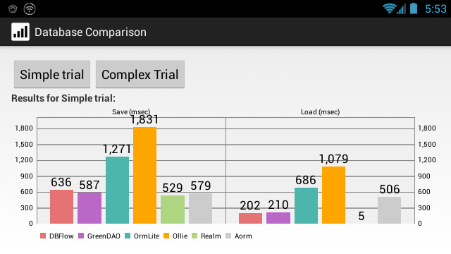
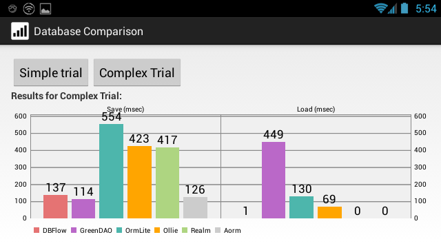

[](https://travis-ci.org/Jamling/Android-ORM)
[](https://github.com/Jamling/Android-ORM)
[](https://bintray.com/jamling/maven/Android-ORM)
[](https://android-arsenal.com/details/1/4306)

# 简介

您是否在Android上使用sqlite来存储您的应用数据呢？如果是，或许您会对Android存取sqlite数据感觉有点小复杂。本人从2010年开始从事Android开发，对于Android的数据库操纵这一块，感觉还是比较复杂的，尤其是可维护性及或可扩展性方面，都是比较差的。
也正是从这时开始，我决定在Android平台上实现像Hibernate那样的ORM框架，来简化开发工作。使得开发者在使用sqlite数据库时，无需关注底层数据库实现，更多的是关注上层业务逻辑实现。
如果您对此项目感兴趣，欢迎您的加入！

# 特性

* 简洁的ORM映射配置, 只需在Java Bean的属性中添加`@Column`的注解即可完成到数据库字段的映射配置.
* 支持原生`ConntentProvider`，可以方便的使用Android `ContentProvider`机制来共享数据，初始化/升级/降级数据库
* 强大的正向工程支持, 有Eclipse [Android ADT-extensions]和Android Studio [Android ORM Tool]插件来自动生成DDL和ContentProvider.
* 给力的辅助工具, 向导式新建Activity/Service/BroadcastReceiver并且自动配置到AndroidManifest.xml.
* ...
更多特性，请自行体验.

# 使用

最新版本 `$latest` 为: [](https://github.com/Jamling/Android-ORM), **在使用中请将`$latest`替换为具体的版本**.

## Eclipse

下载aorm-core-`$latest`.jar并放入libs/目录下

推荐安装[Android ADT-extensions]插件

## Android Studio
Aorm已经发布到jcenter，在您的app/build.gradle中添加以下依赖。

```gradle
dependencies {
    compile 'cn.ieclipse.aorm:aorm-core:$latest'
}
```

推荐安装Android Studio上的[Android ORM Tool]插件，可以快速生成相关代码。

# 类似orm库比较

简单试验结果:



复杂试验结果:



测试工程代码请参考: https://github.com/Raizlabs/AndroidDatabaseLibraryComparison


# 示例代码

## 创建映射
只需添加类`@Table`注解及`@Column`属性注解即可完成表与字段的映射。

```java
@Table(name = "student")
public class Student implements Serializable {
    
    @Column(name = "_id", id = true)
    public long id; //id is Primary key.
    
    @Column(name="_name")
    public String name; //mapping to _name and auto column type
    
    @Column()
    public int age; //auto column type and name
    
    @Column(defaultValue="''")
    public String phone; // default value in empty
    
    public String address; // no mapping
}
```

## Create database

```java
package cn.ieclipse.aorm.example;

import android.content.ContentProvider;
import android.content.ContentValues;
import android.database.Cursor;
import android.database.sqlite.SQLiteDatabase;
import android.database.sqlite.SQLiteOpenHelper;
import android.net.Uri;
import cn.ieclipse.aorm.Aorm;
import cn.ieclipse.aorm.Session;
import cn.ieclipse.aorm.example.bean.Course;
import cn.ieclipse.aorm.example.bean.Grade;
import cn.ieclipse.aorm.example.bean.Student;

/**
 * @author Jamling
 * 
 */
public class ExampleContentProvider extends ContentProvider {
    
    public static final String AUTH = "cn.ieclipse.aorm.example.provider";
    public static final Uri URI = Uri.parse("content://" + AUTH);
    private SQLiteOpenHelper mOpenHelper;
    private static Session session;
    
    @Override
    public int delete(Uri arg0, String arg1, String[] arg2) {
        return 0;
    }
    
    @Override
    public String getType(Uri arg0) {
        return null;
    }
    
    @Override
    public Uri insert(Uri arg0, ContentValues arg1) {
        return null;
    }
    
    @Override
    public Cursor query(Uri arg0, String[] arg1, String arg2, String[] arg3,
            String arg4) {
        return null;
    }
    
    @Override
    public int update(Uri arg0, ContentValues arg1, String arg2, String[] arg3) {
        return 0;
    }
    
    public static Session getSession() {
        return session;
    }
    
    @Override
    public boolean onCreate() {
        mOpenHelper = new SQLiteOpenHelper(this.getContext(), "example.db",
                null, 1) {
            public void onCreate(SQLiteDatabase db) {
                // method 3: use AORM to create table
                Aorm.createTable(db, Grade.class);
                Aorm.createTable(db, Student.class);
                Aorm.createTable(db, Course.class);
            }
            
            public void onUpgrade(SQLiteDatabase db, int oldVersion,
                    int newVersion) {
                // update table, suggested to wrapper in if block
                Aorm.updateTable(db, Grade.class);
                Aorm.updateTable(db, Student.class);
                Aorm.updateTable(db, Course.class);
            }
        };
        session = new Session(mOpenHelper, getContext().getContentResolver());
        return true;
    }
    
}
```

## 查询
```java
        Session session = ExampleContentProvider.getSession();
        // 最简单的查询：查询所有的学生信息.
        Criteria criteria = Criteria.create(Student.class);
        // 添加条件: id相等
        criteria.add(Restrictions.eq("id", 1));
        // 添加条件: name like Jamling
        criteria.add(Restrictions.like("name", "Jaming"));
        // add restriction: age < 30
        criteria.add(Restrictions.lt("age", 30));
        // add order
        criteria.addOrder(Order.asc("age"));
        // set district
        criteria.setDistinct(true);
        // set limit from row 10 to 20
        criteria.setLimit(10, 10);

        List<Student> list = session.list(Student.class);
        // if you use Android CursorAdapter you can:
        Cursor c = session.query(criteria);

        // set alias, so the project will be alias.columnn. e.g. s.name
        // criteria.setAlias("s");
        // multi-table query
        criteria.addChild(StudentMore.class, "m", Criteria.INNER_JOIN,
                Restrictions.geProperty("s.id", "m.id"));
        // query to cursor
        c = session.query(criteria);
        // convert to list.
        List<Object[]> ret = CursorUtils.getFromCursor(c,
                new Class[] { Student.class }, new String[] { "s", "m" });
        // query to list.
        ret = session.listAll(criteria);
        Object[] item = ret.get(0);
        Student s = (Student) item[0];
        StudentMore m = (StudentMore) item[1];
        //
```
## 其它操作
```java
        Session session = ExampleContentProvider.getSession();
        // insert
        Student s = new Student();
        s.setName("Jamling");
        long rowId = session.insert(s, null);
        // update student's name to Jame whose id is 1
        s.setId(1);
        s.setName("Jame");
        int rows = session.update(s);
        // delete student whose id is 2
        session.deleteById(Student.class, 2);
        // query student whose id is 4
        s = session.get(Student.class, 4);
```

# 文档
请参考 http://www.ieclipse.cn/p/Android-ORM/userguide.html

# 作者
Jamling (li.jamling@gmail.com)


[1]: https://img.shields.io/bintray/v/jamling/maven/Android-ORM.svg
[Android ADT-extensions]: https://github.com/Jamling/adt-extensions
[Android ORM Tool]: https://github.com/Jamling/Android-ORM-ASPlugin
